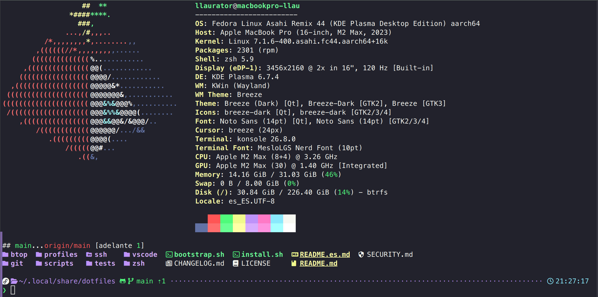

# dotfiles

Personal dotfiles for macOS and selected Linux distributions, installed with Bash and [GNU Stow](https://www.gnu.org/software/stow/).

English | [Español](README.es.md)

> [!WARNING]
> These are personal dotfiles. The installer can install packages, change the login shell, create symlinks, and modify user configuration. Review the scripts before running them and use them at your own risk.

<p align="center">
  
</p>

## Quick start

```bash
curl -fsSL https://raw.githubusercontent.com/llaurator/dotfiles/main/bootstrap.sh | bash
```

For an unattended server installation:

```bash
curl -fsSL https://raw.githubusercontent.com/llaurator/dotfiles/main/bootstrap.sh \
  | bash -s -- --profile server --yes
```

### Inspect first (recommended)

Download and inspect the bootstrap script before executing it:

```bash
curl -fsSLO https://raw.githubusercontent.com/llaurator/dotfiles/main/bootstrap.sh
less bootstrap.sh
bash bootstrap.sh
```

The bootstrap clones over HTTPS, then runs the repository's `install.sh`. It keeps the checkout at:

```text
${XDG_DATA_HOME:-$HOME/.local/share}/dotfiles
```

or at the absolute path set in `DOTFILES_DIR`. Keep this repository: Stow symlinks point to files inside it.

To install a specific tag, branch, or commit instead of `main`:

```bash
curl -fsSL https://raw.githubusercontent.com/llaurator/dotfiles/main/bootstrap.sh \
  | bash -s -- --ref vX.Y.Z --profile server --yes
```

### Manual HTTPS installation

```bash
git clone https://github.com/llaurator/dotfiles.git \
  "${XDG_DATA_HOME:-$HOME/.local/share}/dotfiles"
cd "${XDG_DATA_HOME:-$HOME/.local/share}/dotfiles"
./install.sh
```

## Profiles

The installer offers three profiles:

- `personal` — desktop-oriented setup, including SSH and VS Code configuration.
- `work` — desktop-oriented setup, including SSH and VS Code configuration.
- `server` — avoids the repository's SSH client configuration, VS Code, and desktop configuration.

Non-interactive examples:

```bash
./install.sh --profile personal --yes
./install.sh --profile work --yes
./install.sh --profile server --yes
```

`--yes` requires `--profile` and accepts the installer's confirmations. It does not opt in to VS Code installation.

## Installer commands

```text
-p, --profile PROFILE   personal | work | server
-y, --yes               Do not ask for confirmation
    --migrate-bash-history
                        Import ~/.bash_history into ~/.zsh_history
    --uninstall         Remove managed dotfiles and restore the available baseline
    --keep-packages     With --uninstall, keep packages, upstream clones, and fonts
    --status            Show status without changing files
    --backup-conflicts  Explicitly back up Stow conflicts before installation
    --install-vscode    Explicitly install VS Code for personal/work where supported
    --configure-konsole Explicitly configure Konsole for personal/work
    --dry-run           Simulate history migration or uninstall
-h, --help              Show help
```

Useful commands:

```bash
./install.sh --status
./install.sh --uninstall --dry-run
./install.sh --uninstall
./install.sh --uninstall --keep-packages
./install.sh --migrate-bash-history
./install.sh --migrate-bash-history --dry-run
./install.sh --profile personal --yes --backup-conflicts
./install.sh --profile work --yes --install-vscode
./install.sh --profile work --yes --configure-konsole
```

`--dry-run` is only valid with `--migrate-bash-history` or `--uninstall`. `--backup-conflicts`, `--install-vscode`, and `--configure-konsole` are install-only options.

## What installation changes

The installer detects macOS or Linux and uses the available supported package manager. It installs required tools such as Git, Stow, Zsh, and `jq`, plus available optional command-line tools. It deploys the selected Stow packages, writes the active profile, installs Zsh components from their upstream repositories, and attempts to make Zsh the login shell.

Before Stow runs, conflicts are listed and installation stops by default. It never uses `stow --adopt` and does not overwrite a conflict unless `--backup-conflicts` is explicitly requested.

## Uninstall and rollback

Every new installation cycle creates a baseline under:

```text
${XDG_STATE_HOME:-$HOME/.local/state}/dotfiles/cycles/
```

Baseline format v2 records the managed configuration paths and their previous state, fingerprints of installer-managed changes, the prior login shell, package snapshots before and after package transactions, upstream clones, installed fonts, and created directories and modes. The package snapshots allow it to attribute package changes—including recorded dependencies—without guessing from the package graph at uninstall time.

`--uninstall` first verifies that managed files still match what the cycle installed. It restores the recorded configuration and prior shell only when safe, and removes only attributable packages, intact upstream clones, attributable fonts, and empty created directories. If a path was changed after installation, it stops rather than overwriting it. It does not use `autoremove`; package removal is explicit and has a preflight for unrecorded side effects. `--keep-packages` performs the configuration, shell, and directory rollback while retaining packages, upstream clones, and fonts.

The following are deliberately preserved: Bash and Zsh histories (including the migration backup), the dotfiles checkout, VS Code extensions, and private SSH configuration in `~/.ssh/config.d/*.conf`. Existing or later user changes are not automatically overwritten during rollback.

Older baselines are handled conservatively: a v1 baseline can remove verifiable Stow links, but cannot reconstruct unknown prior state.

## VS Code

VS Code is optional. If `code` already exists, the installer configures it without claiming ownership of its package. Explicit installation is available with `--install-vscode` for `personal` and `work` on macOS, Arch, and Fedora; Debian/Ubuntu does not add a VS Code repository automatically.

The installer merges managed settings instead of blindly replacing valid local JSON, configures the Spanish locale, and installs only missing extensions: Prettier, Ruff, Python Environments, Spanish Language Pack, and Dracula Official. The managed settings select Dracula and enable the repository's formatting defaults. If local VS Code JSON is invalid, it is left unchanged.

## Konsole

Konsole support is optional and is considered only when its `konsole` binary is present for `personal` or `work`. The interactive installer asks before changing anything; `--yes` does not enable it. Use `--configure-konsole` for an explicit non-interactive opt-in. It installs a hash-verified Dracula colorscheme from a fixed official `dracula/konsole` commit, creates `Dotfiles.profile` with Dracula and the detected MesloLGS Nerd Font family, and safely restores the previous default profile and files during rollback.

## SSH and private data

The versioned SSH configuration is generic and includes `~/.ssh/config.d/*`. Real `config.d/*.conf` files, keys, `known_hosts`, and secrets are local-only and must never be committed. The installer does not generate SSH keys or hosts, and it does not replace private local SSH configuration.

Git identity is likewise stored locally in `~/.config/git/local.gitconfig` when configured through the interactive installer; it is not versioned.

## Bash to Zsh history migration

Migration is explicit and separate from normal installation:

```bash
./install.sh --migrate-bash-history
```

It imports unique Bash commands into Zsh's extended history format, preserves the Bash history, and makes one initial `~/.zsh_history.pre-bash-migration` backup. It filters obvious secret-like entries and reports counts rather than commands, but that filter is not a guarantee: inspect the source history before migrating it.

## Supported systems

The installer contains platform paths for:

- macOS (Homebrew is required)
- Fedora
- Arch Linux
- Debian and derivatives, including Ubuntu

Support is limited to the platform and package-manager combinations implemented by the scripts. Other Linux distributions are rejected; no claim is made for untested systems.

## Releases

Releases are automated with `semantic-release` and [Conventional Commits](https://www.conventionalcommits.org/). Use conventional commit messages for changes: `feat` produces a minor release, `fix`, `perf`, `security`, and `revert` produce a patch release, and breaking changes produce a major release. Documentation and maintenance commit types contribute release notes when a release is made but do not create one by themselves.

## Contributing

Issues and focused pull requests are welcome. Keep changes portable across the supported platforms, do not add personal data or secrets, and run the relevant syntax or targeted checks before opening a pull request.
